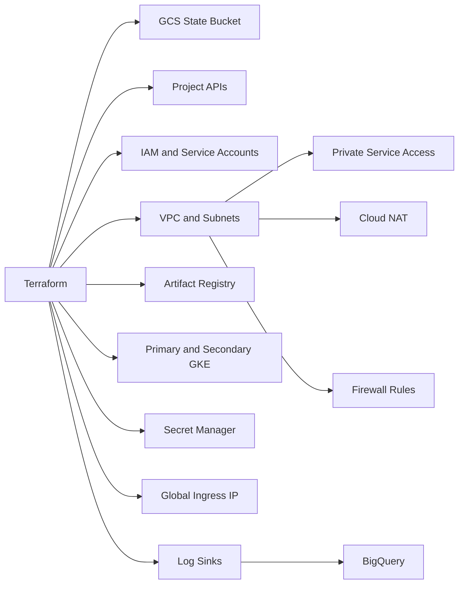
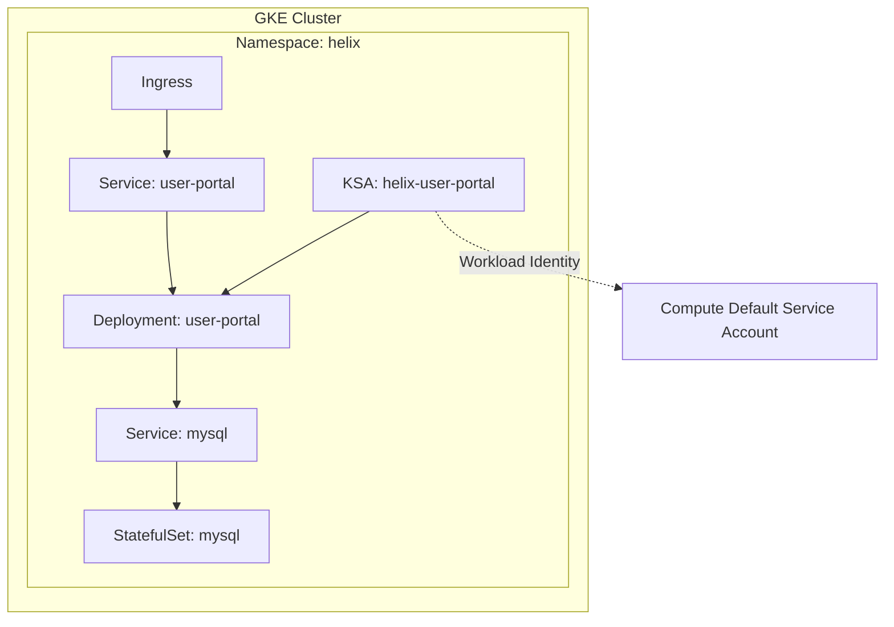
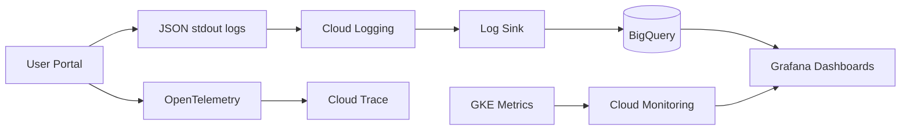
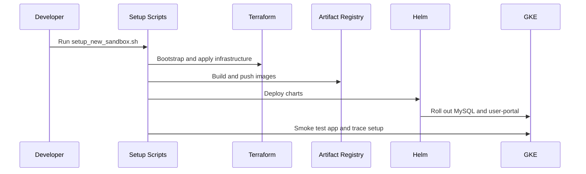

# Architecture

Install a **Mermaid preview plugin** in your editor to render the diagrams in this Markdown file.

Helix runs a Flask user portal and a MySQL database on GKE. Terraform creates the Google Cloud foundation, and Helm deploys the workloads.

## High Level

```mermaid
flowchart TB
    user[End User] --> host[sslip.io Hostname]
    host --> lb[External HTTP Load Balancer]
    lb --> ingress[GKE Ingress]

    subgraph project[Google Cloud Sandbox Project]
        subgraph vpc[VPC]
            ingress --> portal[User Portal UI + API]
            portal --> mysql[(MySQL StatefulSet)]
            nat[Cloud NAT] --> internet[Internet Egress]
        end

        portal --> logging[Cloud Logging]
        portal --> trace[Cloud Trace]
        logging --> bq[(BigQuery Log Datasets)]
        bq --> grafana[Grafana Cloud]
        monitoring[Cloud Monitoring] --> grafana
    end
```

## Terraform Resources

## Kubernetes Workloads

## Observability Flow

## Delivery Flow

